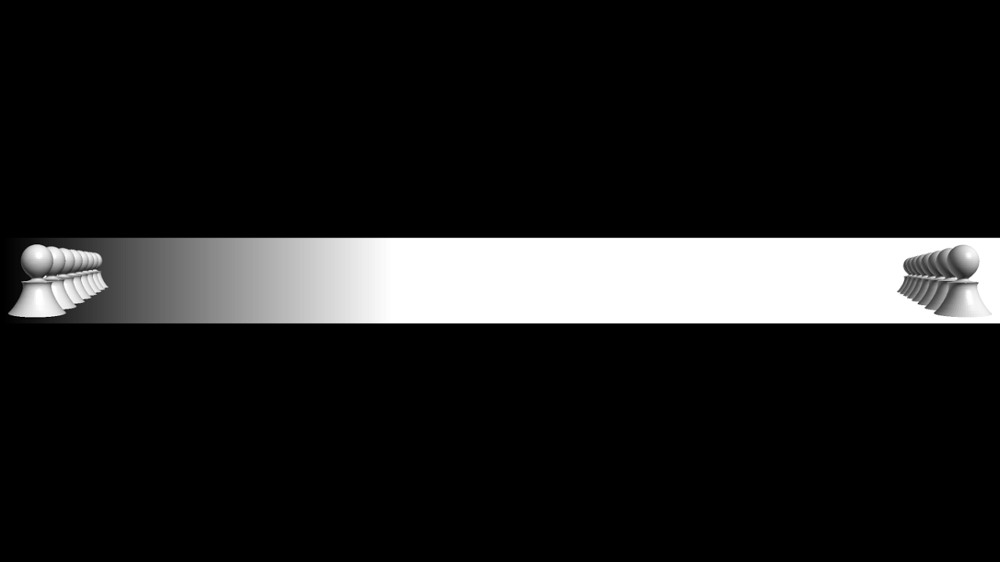

+++
title = "Lorenz Attractors and Chess"
subtitle = ""

date = 2013-03-13T00:00:00
lastmod = 2013-03-13T00:00:00
draft = false
authors = ["David Bieber"]

tags = []
summary = "Every pawn is an inverted Lorenz attractor. Not every Lorenz attractor is an inverted pawn."
+++

Every pawn is an inverted Lorenz attractor. Not every Lorenz attractor is an inverted pawn.

