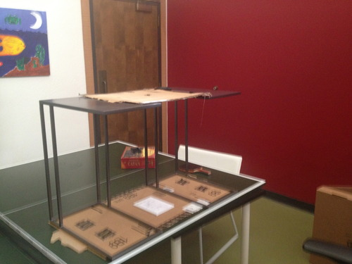

+++
title = "Teach at Scale"
subtitle = ""

date = 2013-08-07T01:00:00
lastmod = 2013-08-07T01:00:00
draft = false
authors = ["admin"]

tags = ["Education", "Hardware"]
summary = ""

[image]
  caption = ""
  focal_point = ""
+++

The best way to learn is to teach. It's also, most of the time, the most fun way to learn. And as an added bonus, the person you're teaching learns too.

I strongly believe that you, as someone who has found themselves reading strange blogs on the internet, have a lot to offer the world in the way of teaching. So I want you to teach at scale. Yes, I'm looking at you Mom and Dad, former Facebook and Twitter interns, my fellow interns here at Khan Academy. I'm looking at you, my Princeton and Nisky friends, and my former MathCounts students. Yes, even you, HackerNews readers and Google searchers and friends of friends. I want you to give teaching at scale a try.

It's hard. Don't mislead yourself into thinking this is an easy task that I've laid out for you. It takes courage and confidence. When you teach at scale, you make yourself vulnerable. You have to be ready for people to catch your mistakes and challenge your teachings. People will out-think you, and you should be ready to embrace that.

What, then, should you teach? I offer two suggestions. 1) Teach what you want to learn, and 2) teach what you know best. Sometimes the best teachers are not those with 10 years of teaching experience in a subject, but rather the people who remember what it's like not to know. Teach something while the Aha! moment that helped you understand it is still fresh in your mind. The second suggestion, teach what you know best, sounds obvious, but the reason behind it has some subtlety. Don't teach what you know best because you'll probably avoid mistakes on that topic -- do it because it's something you can speak passionately about. If your teachings get a student genuinely excited about a topic, that is worth so much more than having them quickly master it.

So how should you get started? The simplest way is to blog. You can set up a blog and be started writing in minutes by signing up at [tumblr.com](http://www.tumblr.com). Once you've written something educational, share it with your friends and with online communities. Related to technology? Post it on HackerNews.

DIY method two of teaching at scale is to make YouTube videos. I gave this a try making videos teaching Item Response Theory and Bloom Filters. Here's my setup.

It's a piece of cardboard with a hole cut out of it for a camera to look through, mounted above some paper. I used my iPhone as the camera.

Here are the resulting Bloom Filter videos, mistakes and stuttering and blurriness and all. I'm pretty embarrassed by them, and I'm hoping future videos I produce will come out better.

https://www.youtube.com/playlist?list=PLTFg4cPjhl-2nrkIR1z_MSTcxNeyPk4PO

I'm going to continue to make videos as I learn awesome things over the years, and I hope you do the same.

How you teach at scale is up to you. Blog. Make videos. Post code. Start a math circle.

Be creative. The most effective teachers-at-scale are not always those who leverage technology to reach a wide audience. They are those who teach passionately, and in doing so infect others with a love for learning and teaching.
