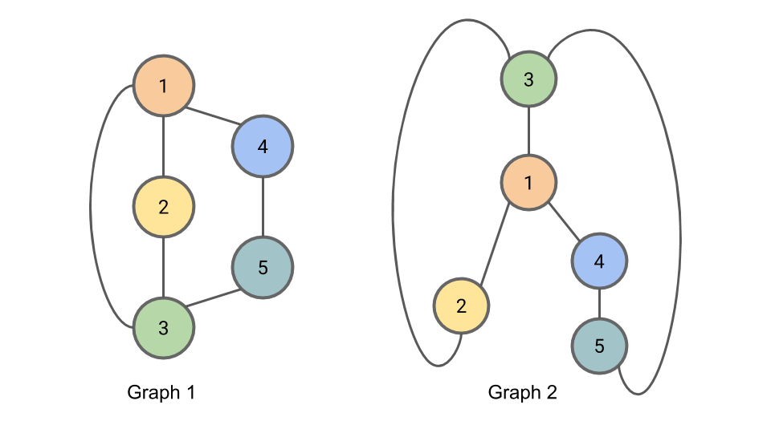

+++
title = "The Weisfeiler-Lehman Isomorphism Test"
subtitle = ""
type = "post"

date = 2019-05-10T00:00:00
draft = false
authors = ["admin"]
math = true

tags = []
summary = "Explains the Weisfeiler-Lehman Graph Isomorphism Test"

[image]
  caption = ""
  focal_point = ""
+++

### Graph Isomorphism

Two graphs are considered isomorphic if there is a mapping between the nodes of the graphs that preserves node adjacencies.
That is, a pair of nodes may be connected by an edge in the first graph if and only if the corresponding pair of nodes in the second graph is also connected by an edge in the same way.
An example of two isomorphic graphs is shown here.

*Figure: Graph 1 and Graph 2 are isomorphic.
The correspondance between nodes is illustrated by the node colors and numbers.*

In general, determining whether two graphs are isomorphic when the correspondance is not provided is a challenging problem; precisely how hard this problem is remains an open question in computer science.
It isn't known whether there is a polynomial time algorithm for determining whether graphs are isomorphic, and it also isn't known whether the problem is $\text{NP-complete}$.
The graph isomorphism problem may even be an example of an [$\text{NP-intermediate}$](https://en.wikipedia.org/wiki/NP-intermediate) problem, but this would only be possible if $\text{P} \ne \text{NP}$.

### The Weisfeiler-Lehman Isomorphism Test

Here is the algorithm for the Weisfeiler-Lehman Isomorphism Test.
It produces for each graph a canonical form.
If the canonical forms of two graphs are not equivalent, then the graphs are definitively not isomorphic.
However, it is possible for two non-isomorphic graphs to share a canonical form, so this test alone cannot provide conclusive evidence that two graphs are isomorphic.

The Algorithm:

-  For iteration $i$ of the algorithm we will be assigning to each node a tuple $L\_{i,n}$ containing the node's old compressed label and a multiset of the node's neighbors' compressed labels.
A multiset is a set (a collection of elements where order is not important) where elements may appear multiple times.
-  At each iteration we will additionally be assigning to each node $n$ a new "compressed" label $C\_{i,n}$ for that node's set of labels.
Any two nodes with the same $L\_{i,n}$ will get the same compressed label.

1. To begin, we initialize $C\_{0,n} = 1$ for all nodes $n$.
2. At iteration $i$ of the algorithm (beginning with $i=1$), for each node $n$, we set $L\_{i,n}$ to be a tuple containing the node's old label $C\_{i-1,n}$ and the multiset of compressed node labels $C\_{i-1,m}$ from all nodes $m$ neighboring $n$ from the previous iteration $(i-1)$.
3. We then complete iteration $i$ by setting $C\_{i,n}$ to be a new "compressed" label, such as a hash of $L\_{i,n}$.
Any two nodes with the same labels $L\_{i,n}$ must get the same compressed label $C\_{i,n}$.
4. Partition the nodes in the graph by their compressed label.
Repeat 2 + 3 for up to $N$ (the number of nodes) iterations, or until there is no change in the partition of nodes by compressed label from one iteration to the next.

When using this method to determine graph isomorphism, it may be applied in parallel to the two graphs.
The algorithm may be terminated early after iteration $i$ if the sizes of partitions of nodes partitioned by compressed labels diverges between the two graphs; if this is the case, the graphs are not isomorphic.

### Example of the Weisfeiler-Lehman Isomorphism Test

We demonstrate here the Weisfeiler-Lehman isomorphism test using the example graphs from above.
The graphs are shown again here for completeness.

*Figure: Graph 1 and Graph 2 are isomorphic.
We will apply the Weisfeiler-Lehman isomorphism test to these graphs as a means of illustrating the test.*

To initialize the algorithm (Step 1), we set $C\_{0,n} = 1$ for all nodes $n$.

For iteration 1, Step 2, we compute $L\_{1,n}$.
The first part of a node's $L$ is the node's old compressed label; the second part of a node's $L$ is the multiset of the neighboring nodes' compressed labels.

For iteration 1, Step 3, we introduce "compressed" labels $C\_{1,n}$ for the nodes:

We now begin iteration 2.
In iteration 2, Step 2, we compute $L\_{2,n}$:

In iteration 2, Step 3, we compute $C\_{2,n}$:

In iteration 3, Step 2, we compute $L\_{3,n}$:

In iteration 3, Step 3, we compute $C\_{3,n}$:

Since the partition of nodes by compressed label has not changed from $C\_{2,n}$ to $C\_{3,n}$, we may terminate the algorithm here.

Concretely, the partition of nodes by compressed label may be represented as the number of nodes with each compressed label.
That is: **"2 7s, 1 8, and 2 9s"**.
This is the canonical form of our graph.
Since both Graph 1 and Graph 2 have this same canonical form, we cannot rule out the possibility that they are isomorphic (they _are_ in fact isomorphic, but the algorithm doesn't allow us to conclude this definitively.)

### Implementation Considerations

One detail omitted is that the algorithm requires canonical forms of the multisets for comparison.
Placing the elements of the multiset in sorted order provides one way of doing this.

Additionally, for the representation of the graph that the algorithm emits to be deterministic, we need to establish a convention for creating compressed labels.
One possible convention is to use increasing integers starting from 1, and to assign compressed labels to nodes in lexicographical order of their non-compressed labels.
Another possible convention is to use the hash of the multiset to create the compressed label.

When comparing the partition of the nodes by compressed label from one iteration to the next to see whether to proceed to another iteration, it is sufficient to compare which nodes are in each partition.
If the partitions change, we proceed to the next iteration.
If no partition changes, the algorithm can terminate early.
When comparing the partitions of the nodes across graphs to see if graphs are isomorphic, we use the canonical form as described above in the algorithm.

### Finding the Correspondance Between Isomorphic Graphs

The core idea of the Weisfeiler-Lehman isomorphism test is to find for each node in each graph a signature based on the neighborhood around the node.
These signatures can then be used to find the correspondance between nodes in the two graphs, which can be used to check for isomorphism.

In the algorithm descibed above, the "compressed labels" serve as the signatures.
Since multiple nodes may have the same compressed label, there are multiple possible correspondances suggested by a Weisfeiler-Lehman labeling.
The Weisfeiler-Lehman isomorphism test itself does not provide a way of narrowing down the possible correspondances further.

### The Disappearance of Boris Weisfeiler

Boris Weisfeiler -- one of the two mathematicians responsible for the Weisfeiler-Lehman isomorphism test -- was a professor at Penn State University until he disappeared mysteriously in Chile in 1985.
His disappearance in the 80s is unsettling, and I would encourage you to visit [boris.weisfeiler.com](http://www.boris.weisfeiler.com/) to learn more about the search for Weisfeiler and the ongoing (2018) judicial proceedings surrounding his disappearance.

Steven List produced an award winning short film called _The Colony_ based on the disappearance of Boris Weisfeiler, available [on Vimeo here](https://vimeo.com/60220290).

After a brief internet search, I have been unable to find any information about Weisfeiler's colleague and coauthor A. Lehman, not even a first name.

### NP-Intermediate Problems

As mentioned in the introduction, it is not known whether the graph isomorphism problem is in $\text{P}$ or $\text{NP-complete}$.
In fact, it is not even known whether graph isomorphism falls in either of these categories, or whether this problem is $\text{NP-intermediate}$.
The problem of factoring integers is another problem like this, where it is unknown whether the problem is in $\text{P}$, $\text{NP-complete}$, or is $\text{NP-intermediate}$.
Bear in mind that $\text{NP-intermediate}$ problems can only exist if $\text{P} \ne \text{NP}$.
So if anyone were to show conclusively that factoring or graph isomorphism were $\text{NP-intermediate}$ they would also have shown $\text{P} \ne \text{NP}$ and won the [Clay Institute P vs NP Millenium Problem](https://www.claymath.org/millennium-problems/p-vs-np-problem)'s million dollar prize.

### Applications of Graph Isomorphisms

Now that you're familiar with the Weisfeiler-Lehman test for graph isomorphisms, what is the graph isomorphism problem good for?

There are applications of the graph isomorphism problem in, for example, computational chemistry and in circuit design.

In chemistry, it is common to represent a molecule as a graph, with the atoms in the molecule being the nodes of the graph and the bonds between molecules being the edges.
Here, the graph isomorphism problem can be used to determine if two chemical structures are in fact the same structure.
This is important for [drug discovery](https://en.wikipedia.org/wiki/Drug_discovery), where scientists are working to create molecular structures that will be useful in order to fight diseases.

A circuit is commonly represented as a graph as well.
The components in the circuit form the nodes of the graph, and the connections between components form the edges.
The graph isomorphism problem is useful here for determining whether two circuits that are laid out different are in fact identical.

### References

Weisfeiler and Lehman first proposed this method in their paper _A reduction of a graph to a canonical form and an algebra arising during this reduction_ in 1968.
An English translation of this paper, originally published in Russian, is [available here](https://www.iti.zcu.cz/wl2018/pdf/wl_paper_translation.pdf).

More recently the method is also described succinctly in [Weisfeiler-Lehman Graph Kernels (Shervashidze 2011)](http://www.jmlr.org/papers/volume12/shervashidze11a/shervashidze11a.pdf).

Now go forth and detect graph isomorphisms!
