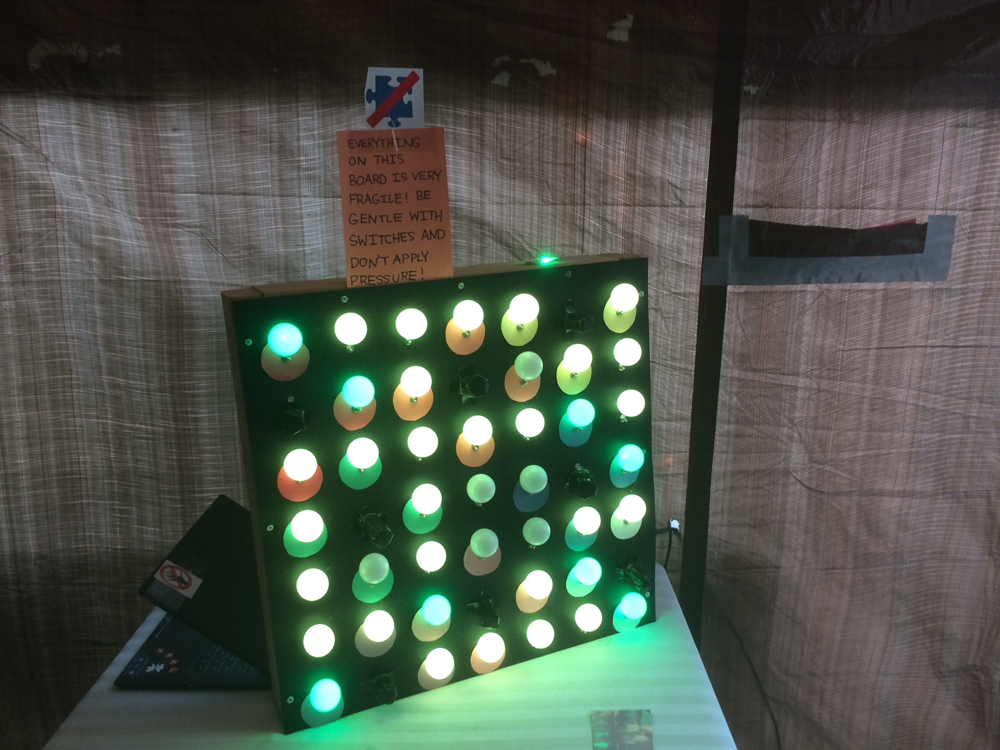

+++
active = false

title = "Escape Castle Heterodyne"
weight = -20171028
date = 2017-10-28T00:00:00

summary = "We built an escape room!"
tags = ["Hardware", "Just for Fun", "Puzzle"]

[image]
  caption = "Lights out: A puzzle in the room of Escape Castle Heterodyne"
  focal_point = "Smart"
+++

We built an Escape Room!

Serious props to Bianca Homberg and her amazing talented group of friends for making this happen.
I was just a small piece of this epic endeavor. Bianca was the organizer and driving force for a really impressive piece of puzzle craftsmanship.

The premise for the escape room is based on the webcomic [_Girl Genius_](http://www.girlgeniusonline.com/). Here's what you need to know:

### Escape Castle Heterodyne

There's a castle, [Castle Heterodyne](http://girlgenius.wikia.com/wiki/Castle_Heterodyne), which is a living, breathing, _talking_ entity. In our escape room, the Castle is voiced by Mark Velednitsky. The castle's personality is damaged, and you and your team (4 people total) have been sent into the castle to see if you can repair it. The castle, in it's damaged state, doesn't understand that you're here to help. Quite the opposite in fact; it considers you hostile! At your entrance, Castle Heterodyne slams its doors shut behind you. It cuts power to the lights and activates its 30 minute self-destruct countdown.

Can you repair the castle, thereby bringing it back to its senses? Can you escape your impending doom? You must solve puzzles and make your way through four decorative challenge-filled rooms if you wish to live to see another day.

### The Engine Room

I was responsible for just the first room of the escape room (as well as, I later learned, anything requiring height). This first room was the Engine Room. When you enter the Engine Room, der Castle promptly kills the lights and initiates the castle's self-destruct sequence.

Your challenge: get the lights up and running again.

You do this by first locating a blacklight flashlight on the table in the room. You use this blacklight flashlight to read clues written in invisible ink on colored paper hidden around the room. These clues in turn allow you to figure out which of the nearly 50 switches you need to flip in order to turn all the lights on without overheating any of them.

This is what the puzzle looks like partial solved:

While the physical puzzle is no longer operational, you can have a go at the software-only version of the puzzle: **[Click here to try the puzzle](/engine-room-demo)**.

### Storage Closet

Once you successfully turn the lights back on in the Engine Room, the castle realizes your utility, and presents you with the key to the next room: the Storage Closet. It's too late to turn off the self-destruct sequence though, and so your only way out is forward, through the Storage Closet and the rest of the castle.

The Storage Closet is in my opinion the coolest room in the Castle. I will refrain from spoiling it here (for now), and simply tell you that I was very impressed with the work that went into it.

### Escaping the Castle

Making your way through the Storage Closet, you must next navigate the Secret Lab, the Pink Torture Chamber (no puzzles here), and lastly the Crypt. Only after solving the puzzles in each of these rooms with the help can you escape der Castle and avoid a ghastly death.

_The source code for the Engine Room puzzle (both the physical version and the software-only version) is available on [GitHub here](https://github.com/bhomberg/heterodyne/blob/master/engine-room/)._