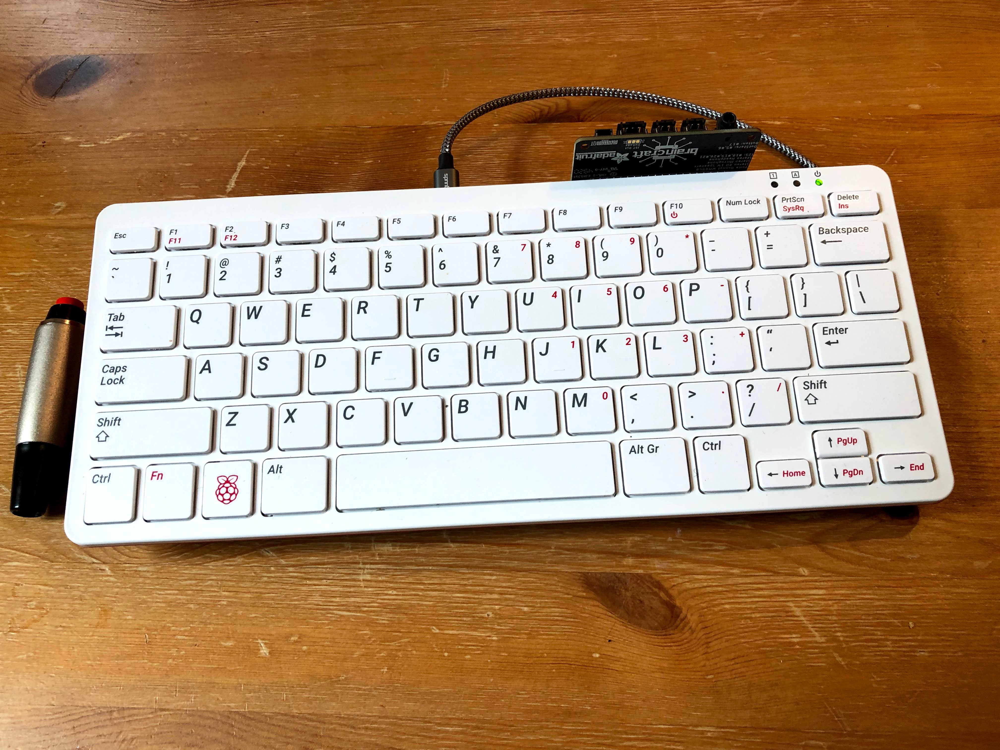
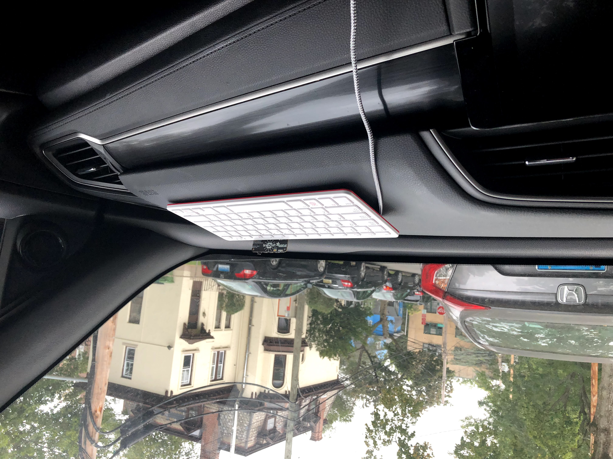
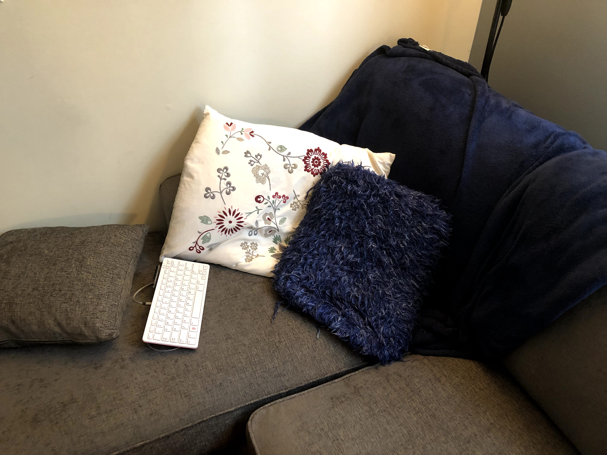
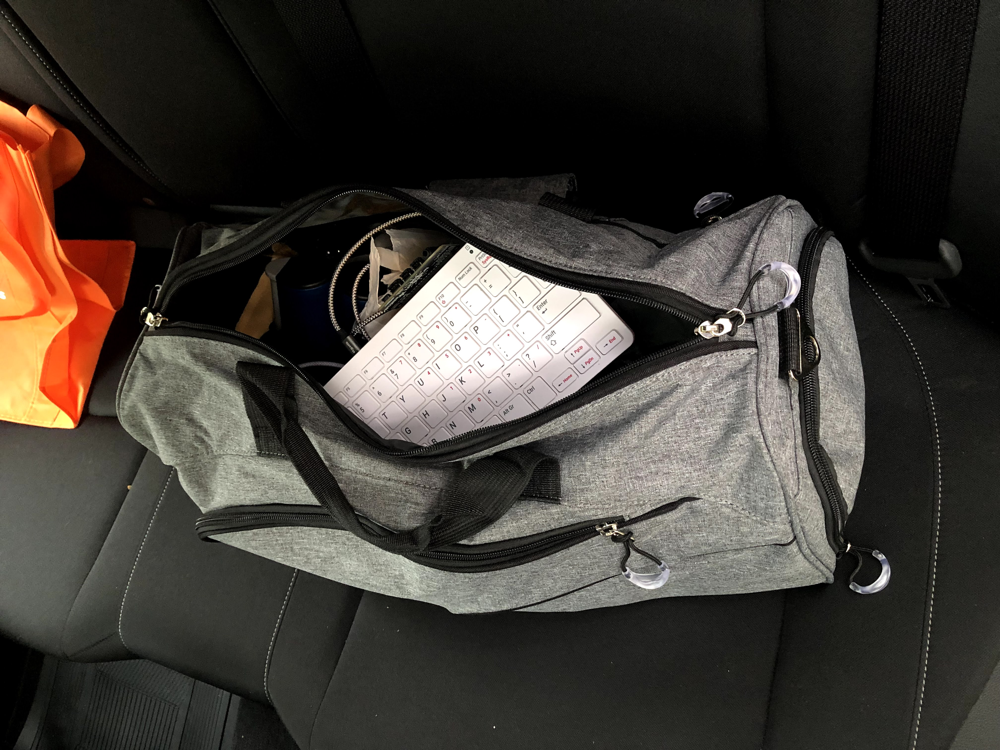

+++
active = true
weight = -20210915

title = "Go Note Go"
date = 2021-09-15T00:00:00

summary = "A note-taking system for when you’re on the go, with a focus on driving and camping."
tags = ["Software", "Hardware", "Productivity", "go-note-go"]

[image]
  caption = ""
  focal_point = ""
+++

_Go Note Go is a note-taking system for when you're on the go, with a focus on driving and camping._

You're driving to your campsite, listening to Tiago Forte discuss Sönke Ahrens's "How to Take Smart Notes", when a brilliant idea strikes you. Do you pull over, pull out your phone or moleskin, and write it down? Nay. Go Note Go to the rescue.

While driving, simply press the large handheld red push button and speak your idea aloud. It will be automatically transcribed and added to your notes once an internet connection becomes available.

Go Note Go is the latest in my line[^1] of headless keyboard technologies, the successor to [shh shell (2014)](/projects/shh-shell). As with [shh shell](/projects/shh-shell), no visual components are required to operate Go Note Go. You control the system only via audio or, optionally, by typing. Unlike with shh shell, it is inadvisable to keep your eyes closed while you use it, particularly if you are driving.

[^1]: Two points define a line, right?

Let's dive deeper now into what is Go Note Go, and what it brings to the note-taking space beyond shh.

### What is Go Note Go?

Physically, Go Note Go is a lightweight portable keyboard with a microphone and speaker, with a beautiful handheld button attached. The keyboard is a Raspberry Pi 400 -- so, it's also a full computer with WiFi, Bluetooth, and a friendly Linux operating system.

It can be powered by USB-C either from a small battery pack that velcros to the back, from a port in your car, a port on your main computer, or a standard outlet.

### What does Go Note Go do?

Go Note Go allows audio and text note-taking, as well as arbitrary audio and text command execution. Let's focus on note-taking first. We'll return to command execution later.

There are two main ways to enter notes with Go Note Go (audio and text), corresponding to the two main use cases (driving and camping). The use cases of shh shell (sleeping and showering) are both still supported.

* Driving
* Camping
* Sleeping
* Showering

To enter notes via *audio*, simply press the large red handheld push button. Then speak your notes. The recording will be saved. When internet connectivity becomes available, your audio will be automatically machine transcribed and included in your note-taking system of choice.

To enter notes via *text*, type them. Press enter to commit a note. Press shift-backspace to clear the currently typed text. When internet connectivity becomes available, your notes will be uploaded to your central note-taking system.

Taking notes by audio is great for driving, or for whenever speaking better suits your way of thinking than typing. Being able to seamlessly go back and forth between speaking and typing can be liberating, allowing for alternating different kinds of thinking.

The system is compact and portable.

It velcros to the passenger side of the car dashboard. It can be used there, or placed on a passenger’s lap during use, or even on the driver’s lap at a rest stop, waiting in line at a drive-thru, or while parked.

It can be powered by the car by USB-C, or by battery pack for use on the go (or from a laptop or outlet USB port, if that better suits your use).

You can lie down with it and type or talk.

Or throw it in your sports bag to take notes on the game!

### How do you use Go Note Go in the shower?

To use Go Note Go in the shower, acquire a waterproof Bluetooth enabled keyboard, and pair it with your Go Note Go Raspberry Pi 400. Go ahead and leave that waterproof keyboard in your shower.

For an improved experience, also acquire a waterproof Bluetooth speaker for your shower, and pair this with the Pi as well.

Now, your Pi simply has to be in range of your shower for you to use Go Note Go when generating your most groundbreaking insights.

No additional setup is required. Run the ":status" command to verify everything is working before typing a note to ensure it doesn't get lost.

### Improvements over Shh Shell

Go Note Go supports audio notes and audio commands, whereas shh shell only supported text entry. If you're trying to fall asleep, text is less likely to wake up your mind, but if you're driving, typing is incredibly dangerous.

Go Note Go works offline and without a laptop nearby. To use shh shell, your keyboard needs to be connected wirelessly to a nearby computer running the shh shell software. Go Note Go's keyboard _is_ a computer, and it can be powered by battery pack, from a laptop, from an outlet, or from the car. Your notes will be uploaded to your main note-taking system as soon as internet connectivity becomes available.

No need for annoying "focused" and "focus lost" announcements. Anyone who sleeps near you will be pleased to hear Go Note Go is always in focus. So it doesn't need to announce "focused" and "focus lost" for you to know if it's OK to type. LED status indicators are also available for you to confirm it's working (or you can run the ":status" command to get an auditory "ok".)

Go Note Go integrates with external note-taking systems. I personally use Dropbox to store the audio clips and Roam Research to store the notes and display the audio (and now several other note-taking systems are also supported). This allows Go Note Go to directly contribute to my Spaced Repetition system, my notes on other projects, my notes on life, etc, and for my Go Note Go notes to be accessible anywhere, even on the go!

Go Note Go still supports all the old capabilities of shh shell. All the old commands still work, but now they work everywhere. Entering notes by text still works, but now it's easier to search through them and return to them later. You can still use Go Note Go as you drift off to sleep, and you can still use Go Note Go when you shower, but now you can also use it as you drive or when you camp.

### Supported Note-taking Systems

Audio clips are uploaded to Dropbox for storage (support for Google Drive forthcoming). The audio is then embedded alongside your notes.

The text notes are uploaded to whatever note-taking system you select; currently we support Roam Research, Notion, Ideaflow, Mem, and RemNote.

The system is extensible to support other storage systems and note-taking systems. I aim to have Go Note Go work with all popular note-taking systems. So, if you want to add a new note-taking system, do get in touch.

### Issuing Commands

Go Note Go comes with an extensible command system. Like with shh shell, you can issue a textual command by starting a note with a colon ":". Examples of supported commands include setting alarms with ":at 9am : alarm", or getting the time read aloud to you with ":time".

See the [shh shell write up](/projects/shh-shell) for more on text commands.

Go Note Go supports voice commands too. I use the keyword "go go" to issue an audio command. "go go time" will cause the system to read the time aloud. And "go go read back" will have the system read back your last typed note.

### Why is it called Go Note Go?

It's a note-taking system for when you're on the go. Like any good note-taking system, it can help you make decisions. This includes but is not limited to go/no-go decisions.

Go Note Go is not implemented in Go.

### Why not just take notes on your computer or phone, or with a voice recorder?

Go Note Go is great at reducing friction. It's really nice not having to switch to a note-taking app. You don't have to switch tabs or windows. You don't have to wait for anything to load. If the keyboard is there and on, you can type on it and know your notes are being recorded (there are LED status indicators for peace of mind.) No latency means minimal cognitive load.

It's also of course nice not having to do any manual uploading or transcription that other approaches might require. And being integrated with your central note-taking system is a big plus over some alternate app approaches.

Support for extensible commands (e.g. for sending messages, reading emails, whatever...) is a nice plus too.

And of course my favorite feature is that there is no monitor, and so no distractions. There's no endless scrolling on Facebook, no accidentally visiting Reddit or Twitter. Just a keyboard, a button, and your brain at peace.

### How is Go Note Go extensible?

There are two ways. You can bring your own note-taking system, and you can add arbitrary voice and textual commands to Go Note Go.

1. Note-taking systems
2. Commands

Go Note Go can support uploading notes to any note-taking system. We started with just Roam Research, and now also support Notion, RemNote, Ideaflow, and Mem. Adding new systems is easy, and if you want to use Go Note Go with a different note-taking system, I'd be happy to help you through the process.

Go Note Go also supports voice and text commands. You can add your own commands as well!

### Why need to push a button instead of a wake word?

I don't want to feel like I'm always being listened to. I also don't want it recording conversations. I only want it to record when I tell it to, and the physical switch is quite satisfying.

### How can I try it out?

The hardware components used are listed on the [GitHub page](https://github.com/dbieber/GoNoteGo). There's no getting started guide yet, so if you are trying it out, don't hesitate to reach out for guidance around the rough edges.
