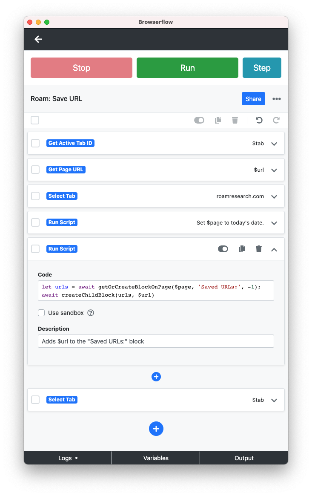

+++
title = "Saving URLs to Roam with Browserflow"
date = 2021-02-13T00:00:00
tags = ["roam-research", "browserflow"]
+++

Using the [Roam JavaScript primitives I wrote yesterday](/snippets/2021-02-12-javascript-functions-for-inserting-blocks-in-roam/) it was extremely easy (less than 10 minutes, I think) to create a robust Browserflow flow for saving URLs to Roam Research.

Now when I'm browsing the web, I can press cmd-J (Browserflow's keyboard shortcut) and choose "Roam: Save URL" from the typeahead to save the current URL to my Roam Daily Notes page.

If there's not already a "Saved URLs:" block on daily notes, it makes it. Then it nests the URL beneath.

Here's what the flow looks like in action:

<iframe width="640" height="360" src="https://www.youtube.com/embed/ORpBuE4UYSA" frameborder="0" allow="accelerometer; autoplay; clipboard-write; encrypted-media; gyroscope; picture-in-picture" allowfullscreen></iframe>

Here's what the flow itself looks like:



Notice there are really only two meaningful lines of code:
```javascript
let urls = await getOrCreateBlockOnPage($page, 'Saved URLs:', -1);
await createChildBlock(urls, $url)
```

The first line creates the "Saved URLs:" block, but only if it doesn't already exist. It returns the uid of that block. The second line saves the url. Nothing else to it!
