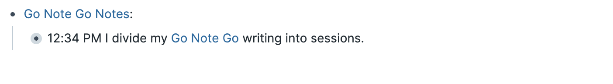

+++
title = "Go Note Go Writing Volume"
date = 2022-02-14T01:00:00
tags = ["go-note-go", "writing", "roam-research"]
+++

Lately I've been writing a lot, but not putting up any new snippets.
Where has all the writing gone? Into [Go Note Go](/projects/go-note-go).

It has been 150 days since I started Go Note Go.
I have written on Go Note Go on 91 of those days, producing 54,000 words.
I've spent a little over 24 hours total doing so, making my writing speed a bit shy of 40 wpm.

I review more of my Go Note Go writing than I might expect, given its volume and that none of it has translated into published snippets.
Since [turning Go Note Go into an outliner](/snippets/2022-01-08-gng-messager-snippet-plans/),
  the experience of reviewing my writing has been much more comfortable than it was previously.

When I write in Go Note Go using the "Roam Research" uploader, my writing is divided into "sessions".
Each session starts with a line containing only the time. The rest of the writing is nested beneath.

When I review my writing in Go Note Go, I do so session by session, putting a summary of the session in that top line of the session, and then collapsing the session. Often the top line is a block-reference to one or more of the lines from the session. For example,

This compresses the 600 words I might write on a given day and presents them in a series of often 10 or fewer individual lines.