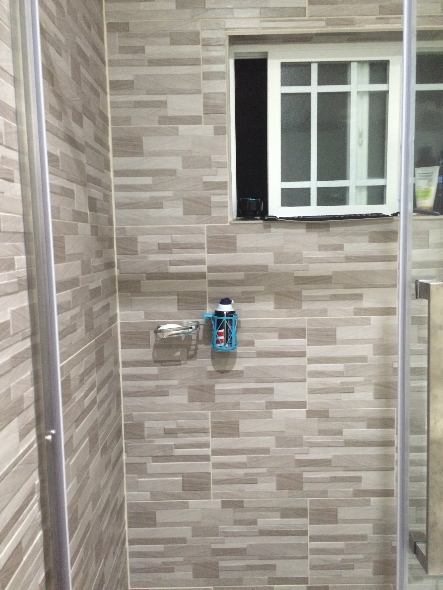

+++
title = "A Complete and Concise List of Go Note Go's Features"
date = 2023-01-16T00:00:00
tags = ["note-taking", "go-note-go"]
+++

[Go Note Go](/projects/go-note-go) is a computer keyboard with no screen that I use to capture ideas anywhere, even as I drift off to sleep.
This is a complete list of Go Note Go's features as of January 2023. Expand any of the features for more information about it.
The main use cases for Go Note Go are capturing thoughts while sleeping, driving, camping, and showering.

<button id="expand-button" onclick="expandCollapseAll()">Expand All</button>

## Main features (Just the useful ones)

Capture typed notes

This is the main feature of Go Note Go. Anything you type on it will show up in your notes.

You don't need to worry about whether you have your note-taking app open, or whether your computer is running slowly.
One of the challenges I face with jotting things down when I'm at a computer is quickly getting to the place where I can jot things down.
Switching to my notes app can be slow!

Even with a keyboard shortcut or a hot corner for taking notes, this requires switching focus on your computer.
You need to wait until the text field shows up. Once the text field has focus, then you can type, but if for some reason your computer is running slowly, your mind will run slowly too. By this, I mean that when letters show up slowly on a screen, it slows down the speed at which you think.
When typing with a screen, people naturally wait for the screen to catch up before continuing typing a thought.

On Go Note Go, there's no screen to see your notes. You don't spend time waiting for the computer to catch up to you.
You don't have to switch windows or click in a textbox before you can start typing.
You simply turn to the Go Note Go keyboard, and everything you type will show up in your notes once the Go Note Go gets an internet connection.

Capture spoken notes

Go Note Go can also capture spoken notes.
Press the capture key (escape, by default; you can also use a large handheld red button if preferred) and Go Note Go will start recording.
Press the capture key again to stop recording.
The recording will be transcribed and added to your notes once Go Note Go has internet.
The raw audio is also included in your notes alongside the transcription.

Capturing spoken notes is especially useful for capturing ideas while driving.
Obviously I'm not typing on the keyboard while I'm driving; that would be unsafe. (The passenger can type though!)

Being able to take spoken notes can also occasionally come in handy as I drift off to sleep.
Usually, I prefer typing, even as I drift off to sleep. It seems to wake me up less.
But when I'm especially tired, speaking can feel like the lower effort method and wake me up less than typing does.

The audio notes are not always transcribed perfectly, and are annotated with "unverified transcription" by default.
You can verify the transcription is correct, cleaning up any transcription mistakes, and can quickly mark the transcription as verified to help you keep track of which transcriptions have and have not been reviewed.

No screen

Not having a screen is one of Go Note Go's major selling points for me, and it comes with a host of benefits.

First and foremost it means that there are no distractions while writing.
As a result my head feels so much clearer when I sit down to write at a Go Note Go compared to writing at a computer.
When writing on a computer, the internet is there with all its [infinite distractions](/2020-10-01-infinite-distractions-and-getting-a-good-sear/), which can make staying focused a challenge.
None of those scroll-inducing websites exist on Go Note Go, making it easier to think and stick to my intentions.

The absence of a screen also helps me to write more effectively.
For me, some of the main challenges in writing are losing time to repeatedly rereading what I've written, and wordsmithing it with relatively inconsequential edits that would be better to hold off until revisions.
Since you can't see typos while working on Go Note Go, you learn to accept them, and you save small amounts of time in significant quantities by not fixing little errors as you write. All of that can be cleaned up in post.

Finally, the main [initial motivation](/post/2022-12-30-go-note-go-story/) for not having a screen is that it lets me capture thoughts even as I drift off to sleep, without waking me up very much.
Alternatives to capturing thoughts like turning on the lights to write on paper, taking out my phone or computer, or speaking into a voice recorder all wake me (or my partner) up more than just typing on a keyboard in the dark.

I actually find Go Note Go helpful for getting to sleep, since it lets me get thoughts out of my head.
Without it, sometimes an anxious thought will swirl around in my head, showing up repeatedly in dozens of different forms.
Using Go Note Go, I can get a single version of the thought into my notes, and somehow that minimizes the thought swirling.
It's as if by finding a canonical version of the thought and preserving it in Go Note Go, my brain is relieved of its duty to hold onto the thought.

Works offline

Go Note Go works offline. You can bring it into the woods with you if you want to go camping, for example.
Normally, I leave Go Note Go plugged into a standard outlet, but I also have a battery pack I take with me for using Go Note Go on the go.

The notes you enter into Go Note Go are uploaded to your notes as soon as internet becomes available.
It's OK if the battery dies before then; the notes are stored on a MicroSD card and will be uploaded later.

Similarly, Go Note Go transcribes your notes once internet becomes available.
Voice notes don't get transcribed on device; we currently use Google Transcription as our transcription provider, which requires an internet connection.
So, voice notes taken in the forest are transcribed and uploaded once you get back to civilization and Go Note Go connects to the internet.

Working offline is particularly useful for using Go Note Go while driving and camping.
It also makes Go Note Go a good candidate for writing in parks or coffee shops.

Act as an outliner

Using tab to indent and shift-tab to dedent, you can use Go Note Go as a proper outliner.
This allows you to take properly nested notes, despite not being able to see them while you take them.

Here is the full list of outliner controls:

* Tab to indent
* Shift-Tab to dedent
* Shift-Delete to clear the current note
* Enter on an empty note dedents
* Shift-Delete on an empty note dedents the maximum amount
* Shift-Enter starts a new session (a separate section of notes)
* 3 minutes of inactivity also starts a new session

Hitting enter on an empty line also causes a dedent.

Run commands

On Go Note Go, any note that starts with a colon is interpreted as a command. There are loads of commands, generally they produce audio output (like reading the time aloud). I've listed the main commands here, and adding new commands with Python is [easy](https://github.com/dbieber/GoNoteGo/blob/main/gonotego/command_center/commands.py) too.

* `:t` or `:time` Read the time out loud.
* `:r` or `:read` Read the last note out loud.
* `:q TEXT` or `:ask TEXT` Ask a question of the AI assistant.
* `:ai` Send the current session of notes to the AI assistant.
* `:at TIME:DO` Schedule command DO to run at time TIME. TIME can be a natural language time like "in 5 minutes" or "8am".
* `:ok` or `:status` Say "ok" out loud; useful for verifying your hands are in the right place and that Go Note Go is on and functioning.

Commands can also be activated via voice. Press the capture button (escape by default) and say "go go" followed by the command to trigger its execution.

There are additional commands for configuring Go Note Go, as well as more technical commands less useful during common usage.

  

Expand this for the full list of commands.

  ### System commands

  * `:whoami` or `:who am i` Read aloud the current user and currently selected note-taking system.
  * `:t` or `:time` Read the time out loud.
  * `:at TIME:DO` Schedule command DO to run at time TIME. TIME can be a natural language time like "in 5 minutes" or "8am".
  * `:status` or `ok` Say "ok" out loud; useful for verifying your hands are in the right place and that Go Note Go is on and functioning.
  * `:say TEXT` Say TEXT out loud.
  * `:shell CMD` Run command CMD in a shell.
  * `:flush` Flush the logs; this is useful for debugging.
  * `:update` Download updates to your Go Note Go; :restart for them to take effect.
  * `:restart` Restart all Go Note Go processes on the device.
  * `:reboot` Reboot the device.
  * `:env` Log the environment variables and their values.
  * `:ip` Read the IP address of the Go Note Go out loud.
  * `:i` or `:internet` Say Yes or No out loud, indicating whether Go Note Go has internet access.
  * `:wifi SSID PSK` or `:wpa SSID PSK` Configure Go Note Go to connect to the wifi with ssid SSID using passkey PSK.

  ### Settings Commands

  * `:get KEY` Read out loud the value associated with setting KEY.
  * `:set KEY VALUE` Set the setting KEY to VALUE.
  * `:clear KEY` Clear setting KEY, reverting its value back to that found in your settings.py file.
  * `:clear` Clear all settings entered via the :set command, reverting their values back to those found in your settings.py file.
  * `:leds ON/OFF/LOW` Set the brightness of the LEDs. Only relevant if you're using the Adafruit Voice Bonnet.
  * `:v ON/OFF` or `:volume ON/OFF` Turn the audio volume on or off.
  * `:get status KEY` Get status indicator given by KEY. The status indicators are [listed here](https://github.com/dbieber/GoNoteGo/blob/main/gonotego/common/status.py).

  The possible settings are [listed here](https://github.com/dbieber/GoNoteGo/blob/main/gonotego/settings/secure_settings_template.py).

  ### Note commands (Unnecessary!)

  * `:note TEXT` Add TEXT as a note. (Just type TEXT! No need to use this command.)
  * `:subnote TEXT` Add TEXT as an indented note. (Just indent and type TEXT! No need to use this command.)

  ### Twitter Commands

  Twitter is not a common use case for Go Note Go, so it's a bit funny that it has it's own section. These commands are predominantly for configuring Go Note Go to use your Twitter account.

  * `:twitter user` Read the current Twitter use out loud.
  * `:twitter user USER` Set the current Twitter user to USER.
  * `:twitter auth` Start the Twitter auth flow for Go Note Go developers (requires ssh and implementation-details to complete).
  * `:twitter auth EMAIL` Start the Twitter auth flow; instructions for completing the flow will be emailed to EMAIL.
  * `:twitter pin PIN` Use this command to complete the auth flow; enter the pin you received in the email from the previous command as PIN.
  * `:twitter` Switch the current note-taking system to be Twitter. Now all notes will be posted directly to Twitter.

  To log into Twitter, run `:twitter`, `:twitter user USER`, `:twitter auth EMAIL`, and finally `:twitter pin PIN` entering the pin you receive in the email.

  ### Email Commands

  * `:email TO SUBJECT: TEXT` Send an email to TO with subject SUBJECT and body TEXT.

  

Adding new commands is always a pleasure, but it's good to keep the capabilities of Go Note Go limited, to prevent potential distractions from creeping onto the device.

Audio-only clock

Go Note Go sports loads of commands (see above), but the one I use most is having Go Note Go read the time out loud. I prefer this to looking at a clock or my phone because I can keep my eyes closed as I use it, so it doesn't wake me up as much.

To trigger this feature, I type `:t`.

AI assistant

The AI assistant is a feature I only added recently to Go Note Go, and I have a [whole snippet](/snippets/2023-01-04-sleeping-with-gpt/) dedicated to my experience with it. It's amazing.

There are two ways of interacting with the assistant today.

1. `:q TEXT` or `:ask TEXT`

If I just want to ask a single question of the assistant, I use this command. The assistant's response is read out loud. This is the more private approach as only TEXT is sent to the AI, not any additional notes.

2. `:ai`

If I want to have an extended conversation or interaction with the AI assistant, I use this command. I can either run `:ai` after typing my message to the AI, or I can prefix my message with `:ai`. Both work. This command sends the entire session of notes to the AI assistant. The AI assistant's response is read out loud, and is included in the session of notes.

In both cases, the AI's responses are included in the notes and are marked as being AI responses.

You can [read more about my experience talking to the AI assistant as I drift off to sleep here](/snippets/2023-01-04-sleeping-with-gpt/).

## But wait, there's more

Use your favorite note-taking system: Roam Research, RemNote, Mem, IdeaFlow, Notion, or even Twitter or Email

The supported note-taking systems are:

* Roam Research
* RemNote
* Mem
* IdeaFlow
* Notion
* Twitter
* Email

Roam Research is the one I use daily.

Why are Twitter and Email on this list?

If you set your note-taking system to Twitter, every note you take on your Go Note Go will be posted to Twitter. This is an unconventional choice! Perhaps you like thinking in public though. Perhaps you live in a community house and want a place to share quirky quotes that come up. You do you.

Email is a nice fallback system for people that don't already use one of the others. When I give Go Note Gos as gifts, I generally configure them to use email so. This lets the Go Note Go work out-of-the-box without the recipient needing to configure it with their account credentials.

You can also switch between note-taking systems at any point with a single command. I recommend making your Go Note Go a single-purpose device with just a single target note-taking system, but you should still note that this is an option. The command to switch note-taking systems is `:set uploader NOTE_TAKING_SYSTEM`, where `NOTE_TAKING_SYSTEM` is one of `email`, `ideaflow`, `remnote`, `roam`, `mem`, `notion`, or `twitter`.

Never miss a note

If you walk away from Go Note Go without hitting enter, your note will be submitted after 3 minutes of inactivity.

Go Note Go boots in about 15 seconds, after which point it is always ready to receive inputs.

The fact that it's always ready -- there's no tab switching or waiting required before you can start typing -- is a big deal to me.
Compared with writing notes on a computer, writing on Go Note Go feels smoother and more natural.
On a computer, I need to switch tabs to give focus to my note-taking app before I can start typing.
That context switch may sound small, but it is meaningful, and I'm glad to have done away with it.

There is also the option to pause note-taking on your Go Note Go. This is not recommended. To enable this, set the PAUSE_HOTKEY setting.
This creates a trigger for pausing and unpausing note-taking.

Send people messages

Sending people messages is actually not a core feature of Go Note Go, but it is something that I built for myself on top of Go Note Go.
If I include text like "@Person" in my notes, then my Messager project will pick up the note and queue up a message to Person.
Notes nested underneath the @-tagged note are also included in the message.

I have [a whole post dedicated to this feature](/post/2022-01-08-new-messager-setup/) if you'd like to learn more.

The supported messaging systems in the Messager project are:

* Facebook Messenger
* Twitter (both public and private tweets, as well as DMs)
* Mastodon
* Hacker News submissions
* Email
* iMessage
* Slack
* Discord - this one unfortunately is not in a working state at this time.

It supports aliases, so that I can set short-names for people to send messages to their preferred communications platform.

Once a message is in the queue, I can clean it up and approve it. I can also specify a time for it to send, with the default being to send now.
Once approved, it sends automatically at the desired time.

Mounts on the passenger side of the dashboard

I put Velcro on the bottom of one of my Go Note Gos, and on the passenger side of my car dashboard.
This way I can mount the Go Note Go in the car.
Using the capture button (e.g. a large handheld red button), you can capture audio recordings while driving.

I've largely switched away from using Go Note Go while driving in favor of calling by AI assistant on the phone (implemented via Twilio).

It's open source

The code and set up instructions for Go Note Go are [all freely available on GitHub](https://github.com/dbieber/GoNoteGo).

The total cost of parts is about $100. I encourage you to make your own! Please [email me if you do](mailto:david810+go-note-go@gmail.com)!

The right amount of customizability

The main thing you can configure is which note-taking system you'd like to upload your notes to.

This can be any of:

* Roam Research
* RemNote
* Mem
* IdeaFlow
* Notion
* Twitter
* Email

Raw audio files are uploaded to Dropbox and included in your notes.

The two other areas Go Note Go can be configured are adding new commands, and adding new note-taking systems.

Your notes are easy to review

As you take notes on Go Note Go, they are divided into sessions.
Each time you sit down at a Go Note Go after a period of inactivity, a new session is created.
You can also start a new session at any time by hitting Shift-Enter.

In your notes, sessions are timestamped and organized chronologically. All the notes in a session are nested underneath the timestamped session header.
When I review my notes, I like to place a one-line summary of a session in the timestamped session header. I can then collapse the session.
This makes it easy to quickly scan through my notes, looking only at the session headers. I can expand a session to see it's contents for more detail.

[Take a look at some example Go Note Go notes here](https://roamresearch.com/#/app/commons-db/page/01-17-2023) to see what this looks like.

## Emergent benefits

Focus and Relief

I like how Go Note Go is a single-purpose device.
The absence of a screen and the absence of any distractions on Go Note Go make for a soothing experience.

I have a desk at home with just a Go Note Go on it.
Sitting down at my Go Note Go desk fills me with an immediate sense of relief.
When writing at a computer, by comparison, I notice a tension in my body.
Go Note Go relieves this tension and clears my head.

Avoid distracting others (incl. w/ Bluetooth headphones)

Raspberry Pi 400s have Bluetooth support. So, you can connect Bluetooth headphones to Go Note Go.

At work, I use Go Note Go with my AirPods. When I put the AirPods in, Go Note Go automatically connects.
I can then ask the AI assistant questions on the Go Note Go and get the answers piped directly to my ears,
so my coworkers are not distracted.
If I take the headphones out, Go Note Go outputs to the attached speaker.
So, I can show colleagues Go Note Go without them needing to put headphones in.

Also consider capturing ideas as you drift off to sleep.
Compared with other options for capturing these ideas, Go Note Go is comparatively non-disruptive.
It doesn't require any bright lights or loud sounds.
It's not perfectly quiet either though, so there's room for improvement here.

Check the time without fully waking up

Go Note Go's commands all work without you ever having to open your eyes.
If you're drifting off to sleep, this is ideal. You can get the time without activating your brain too much, making it easier to continue drifting off to sleep.
Compare this with looking at your phone or at a clock. These options require opening your eyes, possibly subjecting them to bright lights.
No thank you. I prefer Go Note Go's `:t` command for getting the time.

Take it camping

Go Note Go lasts for about twelve hours on this [3A 10400mAh power bank](https://www.amazon.com/gp/product/B07JYYRT7T?th=1).
It's small and lightweight, easy to toss in the car and take camping.
There are [cases](https://www.adafruit.com/product/5292) you can purchase to make Go Note Go more portable for this kind of use case.

Camping was one of the original use cases for Go Note Go, and in fact I designed the system and ordered the first batch of parts while camping.

The core attributes of Go Note Go that make it great for camping are:

* It works offline, so you can use it anywhere; it will upload your notes as soon as you get an internet connection.
* It's portable and can run on battery for a decent length of time.
* There's no screen or bright lights to annoy other campers.

Capture thoughts while drifting off to sleep

The main culmination of the features is that Go Note Go is great for capturing thoughts while you're drifting off to sleep.
This was the primary motivation for Go Note Go's predecessor, [Shh Shell](/projects/shh-shell).
I had some thoughts that were keeping me awake (this is back in 2014!), and I wanted to write them down.
I found that by writing them down, I could get them out of my head, and fall asleep.
However, conventional methods of writing them down would wake me or my roommate up. So, I built Shh Shell to solve that problem.
Today, it has evolved into Go Note Go.

The core attributes of Go Note Go that make it great for capturing sleep thoughts are:

* There's no screen or bright lights to wake you up
* It's always ready to capture notes; there's no fiddling with getting into notes mode in the middle of the night

That it acts as an audio-only clock as well is just a bonus.

Use Go Note Go while driving

I came up with the idea for Go Note Go while driving to a campground.
When I initially built Go Note Go, I included a large handheld red button you could push to trigger audio recording.
This button made Go Note Go useful while driving.
For example, if I was listening to an audio book and wanted to capture a thought, I could simply push the trigger and speak my thoughts aloud.
Then, when I arrive at the campground, I could take the Go Note Go off the dashboard and toss it in the tent.

The core attributes of Go Note Go that make it great for capturing thoughts while driving are:

* It works offline, so you can use it anywhere.
* There's no visual, so you can keep your attention on the road.
* The large red button is easy to push even when you're driving.
* It captures audio notes and transcribes them.
* It mounts nicely to the passenger side of the car dashboard.

Avoid carsickness

As a passenger in a car, it can be tempting to use your phone. Especially if you're taking an Uber and not engaging with the driver, this temptation can be quite strong; phones are little dopamine boxes, and will happily consume your attention endlessly. In a car, this can leave you feeling carsick.

Go Note Go doesn't have this issue. Using Go Note Go in a case, it is truly easy to take on the go. The battery sits in the case and the Go Note Go rests flat on your lap while you use it. The best part? Using Go Note Go doesn't make you carsick, because you're not watching the device as you use it. You're eyes are free to look forward (or wherever) the whole time. Such relief!

Great for long flights

Using Go Note Go with a case makes it so easy to take on the go. And since it works offline, it's ideal for use on a long flight. The battery I use lasts 12 hours, so this works even if your flight doesn't have an outlet. If there is an outlet, 5V is sufficient.

I find I much prefer writing on Go Note Go on a flight compared with hours of back to back movie watching. Not everyone has this predilection; to each their own.

Using a regular computer on a flight can lead to neck strain. Not so with Go Note Go!

Capture shower thoughts

Outside of driving, camping, and sleeping, where else are the best ideas generated? That's right, in the shower.

You can connect a waterproof Bluetooth keyboard to your Go Note Go and bring it into the shower with you to capture these critical insights.
You can also use a Bluetooth shower speaker for audio output.
I have not yet seen a shower microphone suitable for capturing audio thoughts in the shower.

Here is a photo from 2015 of [Shh Shell (Go Note Go's predecessor)](/projects/shh-shell) set up in my shower in California.
The keyboard is on the ledge to the right of the shower speaker.

## Personal Go Note Go usage

I have Go Note Gos everywhere! There's one in my kitchen, one in each bed in my home, and one on each of my desks at home and at work.
Unfortunately there's a backlog on Raspberry Pis (with US keyboard layouts), or else I'd have even more!

Total writing volume

I've written 150,000 words on Go Note Go in the last 16 months. By way of comparison, my notes in Roam Research from the last four years (counting both Go Note Go and other note-taking) total 507,000 words. My [snippets](/snippets) total 123,000 words over two years. My [posts](/posts) total 26,000 words over 10 years.

Giving Go Note Go as gifts

I want other people to experience the joys of Go Note Go. So I have on a few occasions given them as gifts.
There are about ten Go Note Gos out there to the best of my knowledge.

I'd love to put one in a public park one day (connected to Twitter) and see what people type on it.

You can also build your own Go Note Go. It's completely open source. The code and set up instructions for Go Note Go are [all freely available on GitHub](https://github.com/dbieber/GoNoteGo), and the total cost of parts is about $100.

Typing vs talking

The vast majority of my Go Note Go notes I enter by typing, rather than by speaking.
Even when I'm fairly tired, I find that typing wakes me up less than speaking does.
There does reach a point for me where this switches though; when I'm extremely tired, I will sometimes prefer to speak than to type. In those moments, speaking feels lower effort and like it will wake me up less.
It's nice that Go Note Go supports both.

I also have a phone number I can call where my AI assistant picks up, though that project is still early stages.
I use that more than Go Note Go while driving these days, and also prefer that approach when I'm just walking around.

Capturing dreams

When I first started this night typing practice, I wasn't yet comfortable typing without looking, and so my fingers were not positioned correctly on the keyboard. I woke up and saw I had collected a full paragraph of gibberish, ending with the phrase "I hope the FBI doesn't find out about this".
I didn't remember having written anything at all the night before.

One letter at a time I decoded the gibberish. Roughly, each letter had to be shifted by one on a QWERTY keyboard layout; it was a bit of a puzzle to decode. To my amazement and delight, as I decoded the text my memory of writing it came flooding back to me. I can describe it in no other way than that; it was like a missing piece of my brain had been unlocked, truly a rewarding feeling. I had woken up from a dream the night before, typed the dream into the keyboard, and promptly fallen asleep. I didn't remember the dream or that I had typed it until I was decoding the text.
What a relief to find out I wasn't actually hiding anything from the FBI!

Thinking differently at night

I find my brain produces different thoughts while I'm drifting off to sleep as compared with during the day.
(My AI assistant calls this phenomenon either "hypnagogia" or "procrastination". I prefer the former.)

It's a period of calm and reflection, where I am alone with my thoughts.
My brain can process topics that it didn't have a chance to get to throughout the day.

Rather than going against the grain of my brain and trying to induce these thoughts while I'm still awake, I use Go Note Go to capture these thoughts without overly interrupting my bed time routine.

For example, I might think of reaching out to someone while lying awake in bed. Without Go Note Go, I might forget about this in the morning. With Go Note Go, I can write a quick message to them in the moment, and review and send it when I wake up.

Example notes

So that you can get a better picture of what these Go Note Go notes look like, I've copied [a short section of my Go Note Go notes here](https://roamresearch.com/#/app/commons-db/page/01-17-2023). This will give you a brief taste of what the notes look like when I go to review them. You can see how they're divided into time-stamped sessions, how the AI assistant's responses are indented beneath the preceding note, and how I put summaries at the top of some of the sessions. Feel free to take your own notes in that public note-base too!

## Concluding remarks

Overall, building and using Go Note Go these last two years has been a joy. I've met lots of wonderful people through Go Note Go, as there's a lovely community of folks interested in tools for networked thought and audio note-taking. If these topics interest you, definitely [don't hesitate to get in touch](mailto:david810+go-note-go@gmail.com), even if just to say you're interested. And finally for the hackers among you, I encourage you to [try out Go Note Go yourself](https://github.com/dbieber/GoNoteGo). I hope that headless computing becomes more prominent in the years to come, and that you can be a part of that. Let's take away our screens, take back our attention, and live with intention.
